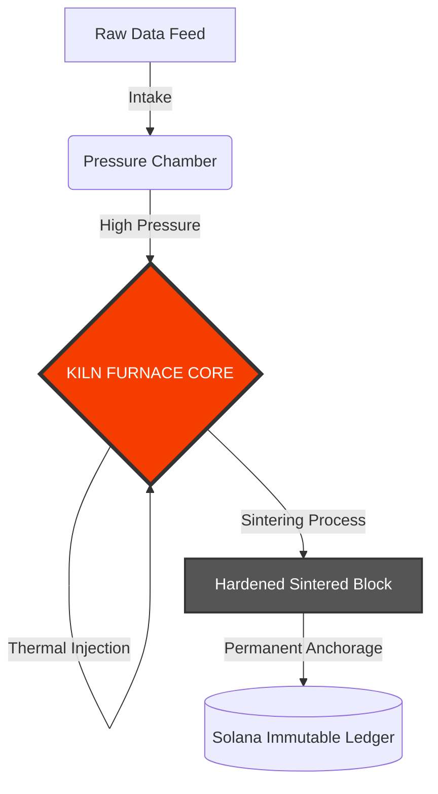

# KILN Industries Core

<div align="center">
  
</div>

<br />

<div align="center">

[](https://solana.com)
[](https://www.rust-lang.org)
[](https://www.anchor-lang.com/)
[]()

[](https://kiln.industries)
[](https://x.com/KilnIndustries)

</div>

<br />

> **PERMANENT DATA SINTERING.**

**KILN** is a decentralized industrial infrastructure protocol designed to forge ephemeral data into immutable, hardened on-chain artifacts. We don't just store data; we apply extreme computational heat and cryptographic pressure to fuse it permanently onto the Solana blockchain.

## Core Features

- **Permanent Anchorage** - Data sintered through KILN becomes immutable on-chain artifacts
- **High-Throughput Processing** - Parallel intake feeds powered by Rayon
- **Cryptographic Fusion** - Blake3 hashing combined with thermal proof generation
- **Industrial-Grade Security** - Multi-layer validation and purity checks

---

## The Industrial Process

1.  **Intake (Feedstock):** Raw, volatile data is ingested via high-throughput feeder queues.
2.  **Pressurization:** Data is compressed and prepared in the pressure-cooker pre-chamber.
3.  **Sintering (The Furnace):** The core protocol applies cryptographic heat (proof generation) and pressure, fusing the data into a solid, tamper-proof state.
4.  **Hardening:** The resulting "Sintered Block" is cooled and permanently anchored to the ledger.

---

## Architecture



## Project Structure

```
kiln/
├── programs/
│   └── kiln-furnace/       # Core sintering engine
│       ├── src/
│       │   ├── lib.rs      # Program entry & instructions
│       │   ├── state.rs    # Account structures
│       │   └── errors.rs   # Error definitions
│       └── Cargo.toml
├── libs/
│   ├── thermal-core/       # Thermodynamics calculations
│   └── pressure-cooker/    # Data compression module
├── cli/                    # Command-line interface
└── tests/                  # Integration tests
```

## Tech Stack

| Component | Technology | Purpose |
| :--- | :--- | :--- |
| Engine | Rust + Anchor 0.29 | Smart contract framework |
| Hashing | Blake3 | High-speed cryptographic hashing |
| Parallelism | Rayon 1.8 | Parallel intake processing |
| Serialization | Bytemuck | Zero-copy data structures |
| Infrastructure | Solana | The bedrock layer |

## Deployment Status

| Module | Status | Metrics |
| :--- | :--- | :--- |
| Furnace Core | **ACTIVE** | 3200°K Operating Temp |
| Pressure Systems | **NOMINAL** | 1500 PSI |
| Intake Feeds | **OPEN** | 10K TPS Capacity |
| Thermal Core | **CALIBRATED** | ±0.1K Precision |

## Quick Start

```bash
# Clone the repository
git clone https://github.com/kiln-industries/kiln
cd kiln

# Build the program
anchor build

# Run tests
anchor test

# Deploy (devnet)
anchor deploy --provider.cluster devnet
```

## Disclaimer

This protocol operates at extreme computational temperatures. Improper usage may result in thermal runaway conditions. Always verify feedstock purity before sintering operations.

## License

Proprietary Industrial Protocol. © 2025-2026 KILN Industries. All rights reserved.
